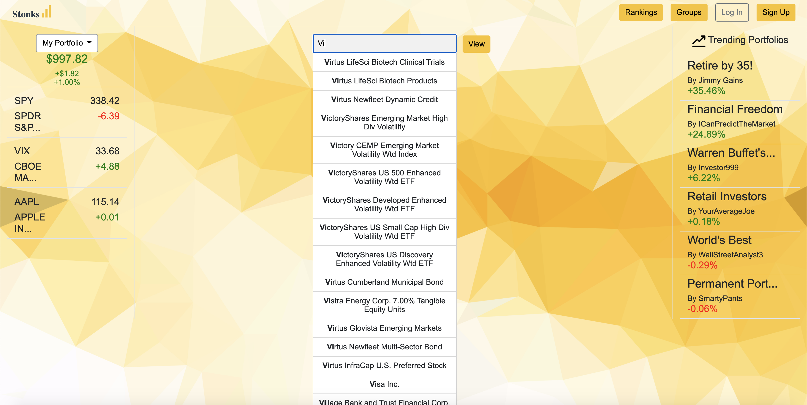

# Team Iota

## [Stonks](https://cs326-final-iota.herokuapp.com/)

## Fall 2020 

## Overview:
Stonks is a website that allows the user to track their stock portfolio and see how it is performing. The user is able to create an account and log in. They will be able to see rankings of other user's portfolios compared to theirs. On the sidebars they will also be able to see trending portfolios and track their own portfolio.

One unique way that Stonks is different compared to other investing sites is the groups page that has the different groups of investors that the user is currently in. 

## Team Members: 
- Golden Wo: @goldenwo
- Zachary Simonelli: @zsimonelli
- William Parsons: @wparsons1

## User Interface:

## Index

Homepage is the landing page for our website. This is where users start off and can then login or create an account.

## Login

This is where users login to our website.

## Register

This is where users can create an account. If successfull in creating an account, the site will prompt user to login.

## Rankings 

This is the rankings page where users can see how they match up against other users. There is also sidebars where you can see trending portfolios and your own portfolio.

## Groups

This is the groups page where users can see groups they are apart. The sidebar is still visible on this page.

## User

This is the user page where users can search any stocks on the market. 

## APIs: A final up-to-date list/table describing your application’s API

## Database:

1. Groups

| Column       | Data Type | Description                    |
|--------------|-----------|--------------------------------|
| name         | text      | The name of the group          |

This table stores the name of the specific group that any number of users could be apart of. 

2. Portfolios

| Column       | Data Type | Description                    |
|--------------|-----------|--------------------------------|
| name         | text      | The name of the portfolio      |
| author       | text      | The author of the portfilio    |
| stock        | text      | The stocks in the portfolio    |
| shares       | integer   | The # of shares of stock       |

This table holds all of the portfolio information needed. This includes the name of the portfolio, the investor behind it, the stocks in the portfolio and the number of shares associated with each stock. These will be used to show users specific portfolios where they will be able to see more details that explains the user's percentage gain or loss.

3. Rankings

| Column       | Data Type | Description                    |
|--------------|-----------|--------------------------------|
| name         | text      | The name of the investor       |
| percentage   | integer   | Percentage positive or negative|

This table holds the rankings information from the website. This includes the names of all of the individual investors which are all linked to a percentage integer. This can be used to rank the user based off of positive percentage gain in the stock market off of their investments. 

4. Users

| Column          | Data Type | Description                    |
|-----------------|-----------|--------------------------------|
| username        | text      | Username of user               |
| salt            | text      | Salt for password              |
| hash            | text      | Encrypted vers of password     |
| assigned_group  | text      | Which groups user is assigned  |

This table holds all of the users information, which includes username, salt, hash, and assigned group. There are essential to determing users accounts and which group each user is in. There is a hash for the password which is used for password authentication. There is also an additional salt added onto the password which then alters the hash value. 

## URL Routes/Mappings:

1. Home Page : https://cs326-final-iota.herokuapp.com/
2. Login : https://cs326-final-iota.herokuapp.com/login.html
3. Register : https://cs326-final-iota.herokuapp.com/register.html
4. Rankings : https://cs326-final-iota.herokuapp.com/rankings.html
5. Groups : https://cs326-final-iota.herokuapp.com/groups.html

## Authentication/Authorization: A final up-to-date description of how users are authenticated and any permissions for specific users (if any) that you used in your application. You should mention how they relate to which UI views are accessible.

## Division of Labor: 
William Parsons: 
- Designed Groups html page
- Worked on homepage html page and main.css 
- Provided explanations for wireframe / pages, helped edit wireframes. 
- Helped create login.js
- Helped create register.js
- Connected github repo to Heroku + deployed and worked on bug fixes
- Helped write all milestones
- Added rubric material and instructions to setup.md

## Conclusion: A conclusion describing your team’s experience in working on this project. This should include what you learned through the design and implementation process, the difficulties you encountered, what your team would have liked to know before starting the project that would have helped you later, and any other technical hurdles that your team encountered.
