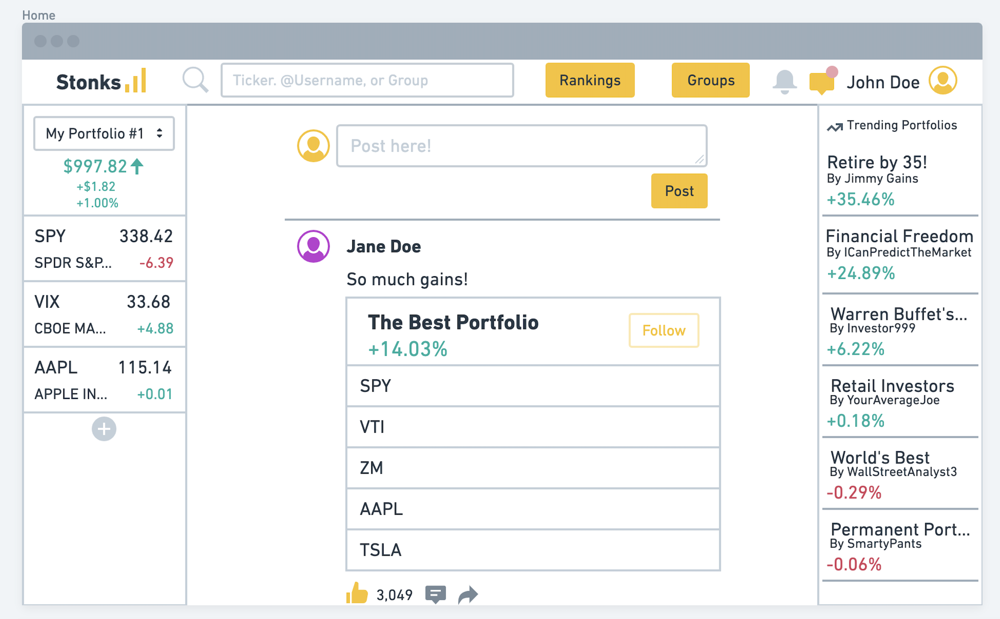

# Team name
Team Iota

# Application name
Stonks

# Team Overview
| Name              | Github Alias                                |
|-------------------|---------------------------------------------|
| Zachary Simonelli | [zsimonelli](https://github.com/zsimonelli) |
| Golden Wo         | [goldenwo](https://github.com/goldenwo)     |
| William Parsons   | [wparsons1](https://github.com/wparsons1)   |

# Innovative Idea
Stonks is a website that hosts an investing competition. It is centered around following users (retail / verified traders) in stocks and crypto who post daily trades. There will be rankings on the website that rank users by ROI / trades in a row profitable for the general public to see. This creates a competitive setting where friends and users of the site can compete with each other and publicize their results. You can compete in various public "leagues" or competitions" with various time horizons (i.e. Weekly, Monthly, Yearly) to see who can make the best decisions and have the best research. You can also create groups and have private competitions within friend groups, classes, clubs, etc. For this website there will also be a big emphasis on the millenial investor with help for people just getting into investing for the first time. There will be sidebars on the side of the pages that show the user's portfolio and trending popular portfolios from verified investors. This is an easy way that the user always stays connected with their own portfolio while browsing various groups and pages throughout the website.

# Important Data
Components to our project include a page that ranks top public investors by gain % with a graph that shows their progress. It would also include a page for all of the groups that would be possible within the website and a place for users to join / interact with these groups. A user account system would also be needed for users to login and record their investments and track how they are performing compared to their peers. 

# User Interface

Below is a list of 4 of our application's pages with screenshots and descriptions for each. 

## Log In

Simple log in page with the ability for users to either login using their credentials or sign up and make an account. It also has an option to remember the user and a link to click if the user forgets their credentials.

## Homepage

The Homepage is the main page of our website. It has a feed aspect to it where the user is updated on other users posts from their groups and can see specific noteworthy events that interests them from portfolios they are following or invested in.

## Rankings

The Rankings page will show all of the user's friends or people invested in a group. There will be buttons to sort on different time horizons, wether it be all time, monthly or weekly. It will then display a ranking based on gain % for that specific time horizon for users to compare themselves to their friends. 

## Groups

The groups page displays all of the groups the user is apart of. The user will then be able to see a preview of a specific group on the groups page. The groups are clickable and display a ranking page, but just for that specific group with only the members within that group showing up.

## Side Bar

The Side Bar and the Notification panel with search bar that has been consistent throughout the website is going to be on every page besides the log in page. The left side bar shows the users their portfolio with results and prominent stocks in their portfolio sorted by percentage gained or lost. The right bar displays public trending portfolios that have had success in the recent past with the ability to view them and see what stocks they have invested in. The top notification and search bar are a place for the user to recieve notifications about group invites or direct messages from a curious investor. There is also a search bar where you can search throughout the website for a certain stock, user portfolio, or specific group.

## Division of Labor

Golden Wo:
Zachary Simonelli:
William Parsons: Designed Groups html page, provided explanations for wireframe / pages, helped edit wireframes. 